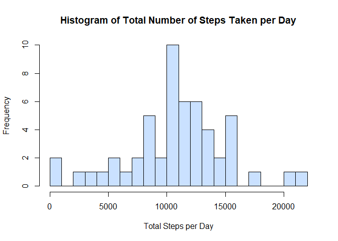
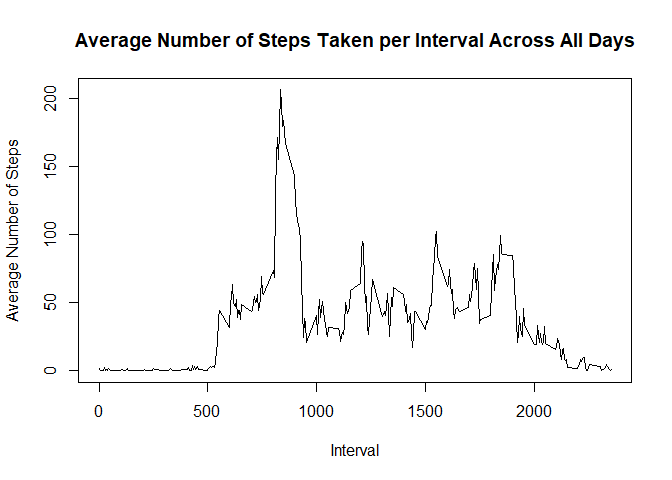
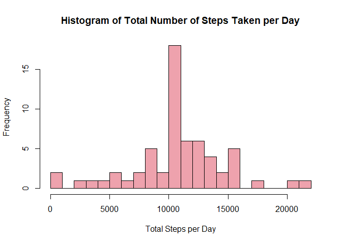
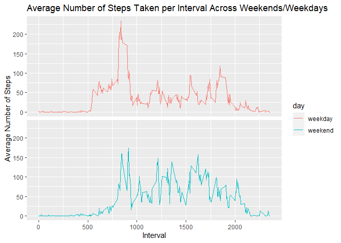

## Loading and preprocessing the data

1. Load the data. Check if csv file exists before unzipping and load `dplyr` and `ggplot2` package.


```r
if (!file.exists('activity.csv')) {
        unzip('activity.zip')
}

library(dplyr)
```

```
## 
## Attaching package: 'dplyr'
```

```
## The following objects are masked from 'package:stats':
## 
##     filter, lag
```

```
## The following objects are masked from 'package:base':
## 
##     intersect, setdiff, setequal, union
```

```r
library(ggplot2)
```

2. Process/transform the data.


```r
data <- read.csv('activity.csv')

data$date <- as.Date(data$date, "%Y-%m-%d")
```


## What is mean total number of steps taken per day? (Incomplete cases are ignored)

1. Calculate total number of steps taken per day. Use `dplyr::group_by` to group data by date, then `dplyr::summarise`.


```r
nonadata <- data[complete.cases(data),] 

totalsteps <- nonadata %>% group_by(date) %>% 
        summarise(steps = sum(steps, na.rm = T))
```

2. Make histogram of total number of steps taken per day.


```r
h <- hist(totalsteps$steps, col = 'lightsteelblue1', breaks = 20,
     xlab = "Total Steps per Day",
     main = "Histogram of Total Number of Steps Taken per Day")
```

<!-- -->

3. Calculate and report the mean and median of the total steps per day.


```r
meansteps <- mean(totalsteps$steps, na.rm = T)

mediansteps <- median(totalsteps$steps, na.rm = T)
```

The mean and median of the total steps per day are 10766.19 and 10765 respectively.

## What is the average daily activity pattern? (incomplete cases are ignored)

1. Make a time series plot of the 5-minute interval and the average number of steps taken, averaged across all days.


```r
averagesteps <- nonadata %>% group_by(interval) %>%
        summarise(steps = mean(steps, na.rm = T))
plot(averagesteps$interval, averagesteps$steps, type = 'l',
     xlab = "Interval", ylab = "Average Number of Steps",
     main = "Average Number of Steps Taken per Interval Across All Days")
```

<!-- -->

2. Find which interval, on average across all the days in the dataset, contains the maximum number of steps.


```r
maxinterval <- averagesteps$interval[which.max(averagesteps$steps)]
```

The 835-th interval contains the maximum number of steps, averaged across all days.

## Imputing missing values

1. Calculate and report the total number of missing values in dataset.


```r
totalmissing <- sum(!complete.cases(data))
```

There are 2304 missing values in the dataset.

2. Impute missing data by using the average for interval across all days.
3. Make new data with imputed values.


```r
newdata <- data
for (i in 1:nrow(newdata)) {
        if (is.na(newdata$steps[i])) {
                newdata$steps[i] <- averagesteps$steps[newdata$interval[i] == averagesteps$interval]
        }
}
```

4. Make histogram of total number of steps taken per day from new data and report mean and median total number of steps taken per day.


```r
newtotalsteps <- newdata %>% group_by(date) %>%
        summarise(steps = sum(steps, na.rm = T))

hist(newtotalsteps$steps, col = 'lightpink2', breaks = 20,
     xlab = "Total Steps per Day",
     main = "Histogram of Total Number of Steps Taken per Day")
```

<!-- -->

```r
newmeansteps <- mean(newtotalsteps$steps, na.rm = T)

newmediansteps <- median(newtotalsteps$steps, na.rm = T)
```

The mean and median of the total steps per day are 10766.19 and 10766.19 respectively. Since each interval with an NA value has been imputed with the average interval value across all days, the mean total remains the same, but there is an significant increase in the number of dates that have the average total, thus the median has shifted towards the mean value.

## Are there differences in activity patterns between weekdays and weekends?

1. Create factor variable with levels: 'weekday' and 'weekend'


```r
nonadata <- nonadata %>% mutate(day = weekdays(date)) %>%
        mutate(day = factor(day %in% c("Saturday","Sunday"), 
                            labels = c("weekday", "weekend")))
```

2. Make panel plot containing a time series plot of the 5-minute interval and the average number of steps taken, averaged across all weekday days or weekend days.


```r
averagesbyfactor <- nonadata %>% group_by(day, interval) %>%
        summarise(mean = mean(steps), .groups = "keep")
g <- ggplot(averagesbyfactor, aes(interval, mean))
g + geom_line(aes(color = day)) +
        facet_grid(day~.) +
        theme(strip.text.y = element_blank()) +
        labs(title = "Average Number of Steps Taken per Interval Across Weekends/Weekdays",
             x = "Interval", y = "Average Number of Steps")
```

<!-- -->
